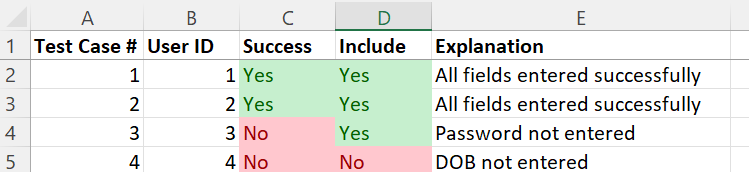
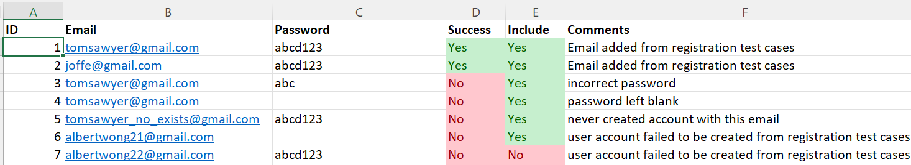
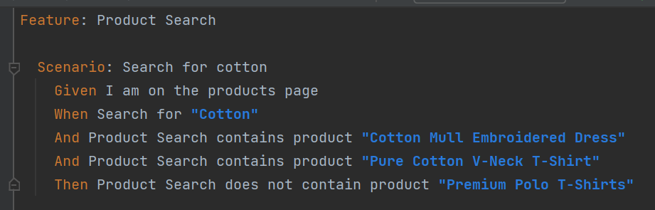
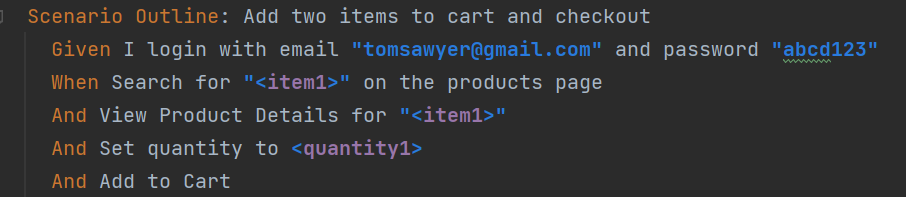

Each module corresponds to a TestNG test runner as specified in the `testng.xml` in the root of the project directory.
Below is a description of each module

### Registration

Reads from an excel spreadsheet `src/test/resources/account.xlsx` to attempt to register users as specified in `users` tab. Test cases for each registered user are specified in `Registration test cases` tab. You have the option to include/exclude test cases from running (see below).

See [source code](https://github.com/chrisgioia64/ecommerce-automation/blob/master/src/test/java/ecommerce/tests/RegistrationTest.java)

### Login

Reads from the same excel spreadsheet as registration module, but this time in the `login test cases` tab. Performs both UI testing (via Selenium) and API testing (API 7 from the [API test list](https://www.automationexercise.com/api_list)). Depends upon the completion of registration test cases.

See [source code](https://github.com/chrisgioia64/ecommerce-automation/blob/master/src/test/java/ecommerce/tests/LoginTest.java)

### Product
Performs a combination of front-end and back-end testing for the APIs 1-5 of the [API test list](https://www.automationexercise.com/api_list). Since no log-in is performed, no dependency on registration module is required.
1. API 1 -- Get all products via API call. Verify product details from API match contents of [product details page](https://www.automationexercise.com/product_details/1). Option to perform cross-browser testing.
2. API 2 -- Verify that POST to products list is unsupported
3. API 3 -- Get all brands via API call. Verify brand information from API match contents of [product details page](https://www.automationexercise.com/product_details/1). Option to perform cross-browser testing.
4. API 4 -- Verify that PUT to all brands list is unsupported
5. API 5 -- POST to search parameter. Use TestNG parameter to specify a search query to perform in the search bar of the products page. Verify that search results match between API and [product page](https://www.automationexercise.com/products)

See [source code](https://github.com/chrisgioia64/ecommerce-automation/blob/master/src/test/java/ecommerce/tests/ProductTest.java)

### Search

A Cucumber feature that performs a search query on the [product page](https://www.automationexercise.com/products) and verifies that certain products do and do not exist in the search results.

See [feature file](https://github.com/chrisgioia64/ecommerce-automation/blob/master/src/test/java/ecommerce/cucumber/search/features/search.feature)

### Cart Checkout

A Cucumber feature that goes through different user flows for a logged-in user adding products of varying quantities to a cart and then checking out.
Ideally, we would like this to depend upon the registration module but currently we log in as a user that is guaranteed to exist.

See [feature file](https://github.com/chrisgioia64/ecommerce-automation/blob/master/src/test/java/ecommerce/cucumber/cart/features/cart.feature)
